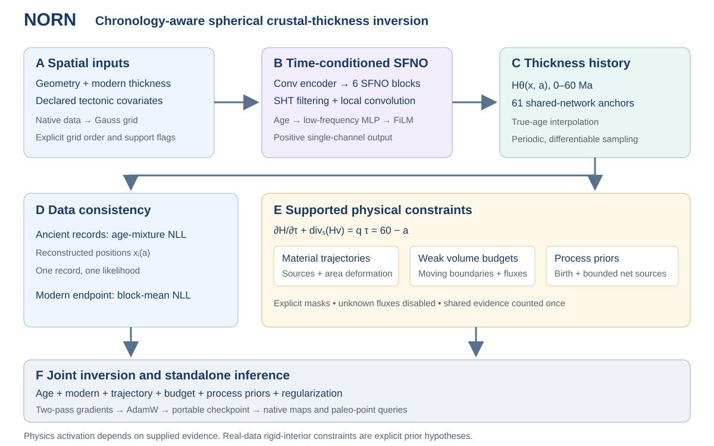

# NORN｜诺恩

**年代不确定性感知、具有显式物理约束的全球古地壳厚度反演软件。**

NORN 用年代条件球面神经算子表示 0–60 Ma 的厚度历史，将古厚度记录的年龄边缘似然、现代厚度观测与适用区域内的运动学及体积预算写入同一个优化目标。训练针对一组观测求解；训练后的 checkpoint 可以独立生成历史地图和点位预测。



> 当前版本：**0.2.0，研究软件 Beta**。这是可安装、可训练、可恢复和可推理的软件发布版本；运行验证不等于全球古厚度已经获得地学验证。真实数据样例保留 `unverified_proxy` 标记，默认输出点估计，不提供已校准置信区间。

## 安装

支持 Python **3.9–3.12**；新环境建议 Python 3.11。训练和推理需要 PyTorch 2.5.1 与 torch-harmonics 0.8.0。数据准备、配置检查和 CLI 帮助可以在不安装 PyTorch 的环境中使用。

在本仓库根目录执行：

```bash
git clone https://github.com/zhaorui-bi/NORN.git
cd NORN
python3 -m venv .venv
source .venv/bin/activate
python -m pip install --upgrade pip

# CPU 环境
python -m pip install torch==2.5.1 --index-url https://download.pytorch.org/whl/cpu
python -m pip install -e '.[sfno,kinematics,export,dev]'

norn --version
norn --help
```

本地 NVIDIA A40 验证使用 CUDA 12.1 版本的 PyTorch：

```bash
python -m pip install -r requirements/a40-cu121.txt
python -m pip install -e '.[sfno,kinematics,export,dev]'
python -c 'import torch; print(torch.__version__, torch.cuda.get_device_name(0))'
```

如果已有 `uv`，可用 `uv pip install --python .venv/bin/python ...` 替代上述 pip 安装命令。基础安装为 `pip install -e .`；可选依赖 `sfno`、`kinematics`、`export`、`viz`、`dev` 分别提供球面模型、板块重建、NetCDF、绘图和开发工具。

## 五分钟可运行示例

示例在本地生成已知真值、现代 DAT、古观测和完整物理约束，不需要下载真实数据。CUDA 可替换为 `cpu`。

```bash
norn demo --output outputs/demo --device cuda
norn train --config outputs/demo/config.json
norn infer --checkpoint outputs/demo/run/best.pt \
  --ages 0 13.4 30 60 --output outputs/demo/predictions \
  --device cuda --formats npz dat netcdf
norn evaluate --checkpoint outputs/demo/run/best.pt \
  --dataset outputs/demo/run/dataset.npz --split validation \
  --output outputs/demo/validation.json --device cuda
```

该示例实际启用轨迹、弱形式预算、出生厚度先验和有界净源系数的联合优化。它用于验证软件计算与可控反演，不能用作真实地质过程的精度证据。

## 真实数据训练

所有路径相对于 **JSON 配置文件所在目录** 解析，命令行 `--output` 则相对于当前目录解析。设备由配置或 `--device` 明确选择，发布入口不依赖机器专属路径或外部授权 JSON。

需要的观测 CSV 列：

```csv
observation_id,present_lon,present_lat,age_lower_ma,age_upper_ma,thickness_km
sample_001,-120.0,40.0,12.0,18.0,35.0
sample_002,85.0,32.0,40.0,40.0,60.0
```

经度可使用 `[-180,180]` 或 `[0,360)`；单位分别为度、Ma 和 km。也可以直接读取本项目原始中文列名的 XLSX。现代数据使用 `180×360` 原生格点的三列 DAT，按南到北、经度从 `0.5°` 到 `359.5°` 排列，第三列为历史数据约定的**负编码厚度**；内部和导出结果均使用正厚度。详见 [数据格式与来源](docs/data.md)。

先复制 [通用配置](configs/reconstruction.json)，填写观测、现代 DAT、旋转文件和静态多边形路径，再准备数据：

```bash
norn prepare --config configs/reconstruction.json --output processed/dataset.npz
norn train --config configs/reconstruction.json --dry-run
norn train --config configs/reconstruction.json
```

`coordinate_mode: paleo` 会在每个真实年龄节点通过 pygplates 重建古位置。无法定位的记录整条剔除或报错，由 `position_failure` 控制；不会无提示地退回现代坐标。年龄超出重建域的部分会被条件化并记录保留质量，域外点年龄不参与训练，推理禁止外推。

本工作区的 A40 复现实验使用 [configs/a40.json](configs/a40.json)：

```bash
norn prepare --config configs/a40.json --output processed/release_dataset.npz
norn prepare-rigid-priors --config configs/a40.json \
  --dataset processed/release_dataset.npz --output processed/release_rigid_priors.npz
norn train --config configs/a40.json
norn infer --checkpoint outputs/release_a40/best.pt --ages all \
  --output outputs/release_a40/inference --device cuda --formats npz dat netcdf
```

该配置使用 180×360 的 Gauss 网格、6 个 SFNO 模块、32 个通道、`lmax=mmax=32` 和 61 个 1 Myr 锚点。真实数据约束采用已声明的误差尺度。生成的物理文件使用**模型导出的刚性板内无净源假设先验**，轨迹与预算按板块分配互斥角色；它不代表已有独立资料证实这些区域 60 Myr 内没有变形或岩浆作用。软件也支持接入独立物理资料，格式见 [物理约束接口](docs/physics.md)。

## 断点恢复和模型选择

```bash
# 有限步数检查，仍按配置的完整训练计划计算学习率
norn train --config configs/a40.json --output outputs/check --stop-after 10

# 恢复同一训练计划
norn train --config configs/a40.json --output outputs/check \
  --resume outputs/check/last.pt
```

每次运行保存：

| 文件 | 内容 |
|---|---|
| `best.pt` | 根据验证侧分数选择的参数，包含配置、输入特征和来源信息 |
| `last.pt` | 最新参数、优化器和随机状态，可继续训练 |
| `training_log.csv` | 原始目标、各损失分量、验证指标、梯度范数和耗时 |
| `run_manifest.json` | 配置、环境、数据哈希和物理适用假设 |
| `training_summary.json` | 实际完成步数、最终状态指标、GPU 峰值显存 |
| `dataset.npz` | 自动准备时保存的冻结数据；使用外部 prepared 文件时保留在原路径 |

恢复时检查数据哈希、模型结构和物理约束。新版本 checkpoint 与历史实验权重不兼容。默认评估验证集；训练不会自动打开测试集。地理组划分是缺少研究 ID 时的代理，现代端点参与训练，因此不能把这些分数当作“完全未见现代资料”的空间泛化结果。

## 推理和导出

checkpoint 内包含推理所需的空间特征。只复制 `best.pt` 到另一台安装了 `sfno` 依赖的机器，即可生成地图，无需原始 Excel、现代 DAT 或物理约束文件。

```bash
norn infer --checkpoint best.pt --ages all --output predictions --device cpu
norn infer --checkpoint best.pt --ages 0 13.4 60 --output predictions \
  --formats npz dat netcdf --device cuda
```

输出地图为原生 `180×360` 网格，纬度南到北，经度 `0.5°…359.5°`，厚度单位 km：

- `thickness.npz`：`thickness_km[age,latitude,longitude]`，含年龄、坐标和 JSON 元数据。
- `thickness_<age>Ma.dat`：64,800 行 `lon lat thickness_km`，正厚度。
- `thickness.nc`：带坐标的 NetCDF；需要 `export` 可选依赖。
- `inference_manifest.json`：checkpoint 哈希、适用假设和点估计标识。

点位接口接受**所查询年龄的坐标**，不是未经重建的现代样品坐标：

```python
from norn_earth.inference import NornPredictor

predictor = NornPredictor("best.pt", device="cuda")
thickness = predictor.predict_points(lon=[-120, 85], lat=[40, 32], age=[13.4, 40])
maps = predictor.predict_grid([0, 30, 60])
```

也可使用 `norn predict-points --checkpoint best.pt --csv queries.csv --output predictions.csv`，输入列为 `longitude,latitude,age_ma`。更多说明见 [推理接口](docs/inference.md)。

## 方法与实现范围

网络输出正厚度场：

$$H_\theta(x,a)=\operatorname{softplus}(F_\theta(X,a)(x))+\epsilon.$$

连续年龄查询在相邻锚点之间线性插值。古观测通过年龄节点的 Student-t 混合似然参与拟合，每条记录贡献一次证据；现代数据通过空间块平均的高斯负对数似然约束 0 Ma。

$$\mathcal L=\lambda_o\mathcal L_{age}+\lambda_0\mathcal L_{modern}
+\lambda_k\mathcal L_{traj}+\lambda_v\mathcal L_{budget}
+\lambda_p\mathcal L_{prior}+\lambda_r\mathcal R.$$

物理模块使用向现代推进的时间 $\tau=60-a$。支持净源项 $q=\sum_j c_j\psi_j$，系数有界并具有指定协方差先验；不提供自由逐像素噪声或源项头。完整方程和源码对应关系见 [方法说明](docs/method.md)。

| 功能 | 软件实现 | 当前真实数据配置 |
|---|---|---|
| 年代条件 SFNO、正厚度、连续年龄查询 | 已接入统一训练与推理 | 启用 |
| 年龄混合似然、现代块平均 NLL | 已实现 | 启用 |
| 年龄节点的板块重建古位置 | 已实现 | 启用 |
| 材料轨迹与弱形式预算 | 可微损失，支持显式有效域 | 启用声明假设的刚性板内先验 |
| 变形与源项 | 通过轨迹散度及源基函数进入同一方程 | 缺独立资料，未启用定量变形／源汇 |
| 洋壳出生 `Q_retained/u_full` 先验 | 已实现，合成例子验证 | 缺独立生产率资料，未启用 |
| 有界低维源项联合优化 | 已实现，合成例子验证 | 未估计真实岩浆生产或损失 |
| 历史厚度校准置信区间 | 本版不提供 | 输出明确标为点估计 |

`1° / 1 Myr` 是输出采样间距，不是已经验证的地质分辨率。静态多边形边缘距离不等于真实动态板界距离；没有可靠变形覆盖资料时，该输入通道为零，并在 manifest 标记缺失。未知边界通量屏蔽整个预算，不能用零填充。

## 验证与开发

```bash
python -m pytest -q
ruff check src tests scripts
ruff format --check src tests scripts
python -m build
```

测试包含周期经度、真实年龄插值、球面网格保守映射、完整目标的两遍梯度等价性、正向物理时间与源汇符号、未知通量屏蔽、证据重复计数、有界源项、断点恢复和离开原数据后的独立推理。CI 分别运行基础依赖和 CPU SFNO 环境。本地 A40 的实际配置、结果与产物见 [验证记录](docs/validation.md)。

已在本地 A40 完成真实数据 **500 步训练**，联合目标 `13.52 → 5.01`，峰值显存约 **1.51 GiB**；同一 checkpoint 成功导出 **61 张 180×360 地图**，NPZ／DAT／NetCDF 数值核对通过。完整测试 **93 项通过**。这些结果验证软件运行与计算路径，地学精度仍需独立资料检验。

## 仓库布局

```text
norn/
├── src/norn_earth/        # 可安装的库和 CLI
│   ├── data/             # 数据准备、观测和板块重建
│   ├── geometry/         # 球面网格、可微取样和保守映射
│   ├── models/           # SFNO 与统计基线
│   ├── physics/          # 物理约束、适用掩膜和低维源项
│   ├── losses/           # 统一的观测与联合目标
│   └── training/         # 两遍训练、checkpoint 与恢复
├── configs/              # 通用、A40 和统计重建配置
├── scripts/              # 兼容入口、官方复现脚本
│   └── legacy/           # 历史实验，禁止用于本版结果复现
├── tests/                # 单元、数值回归及端到端测试
├── docs/                 # 方法、数据、接口及验证文档
├── requirements/         # 经验证的运行依赖版本
└── .github/workflows/    # 测试和构建 CI
```

目录组织参考 [OlmoEarth](https://github.com/allenai/olmoearth_pretrain) 的库、脚本、文档和测试分工；NORN 没有使用其模型权重或训练实现。原项目 `fig` 与中文 Methods 的设计脉络保留在 [设计资料](docs/design/README.md)。历史试验 README 和旧脚本已归档，旧挑战集结果不作为本版精度证据。

## 贡献与许可

开发约定见 [CONTRIBUTING.md](CONTRIBUTING.md)，版本变更见 [CHANGELOG.md](CHANGELOG.md)。软件采用 [Apache License 2.0](LICENSE)。原始观测、外部板块模型和运行产物不随源码包分发，其许可与来源由各数据提供者决定。
