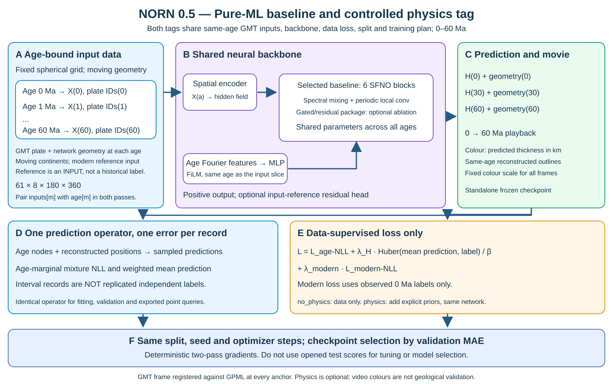
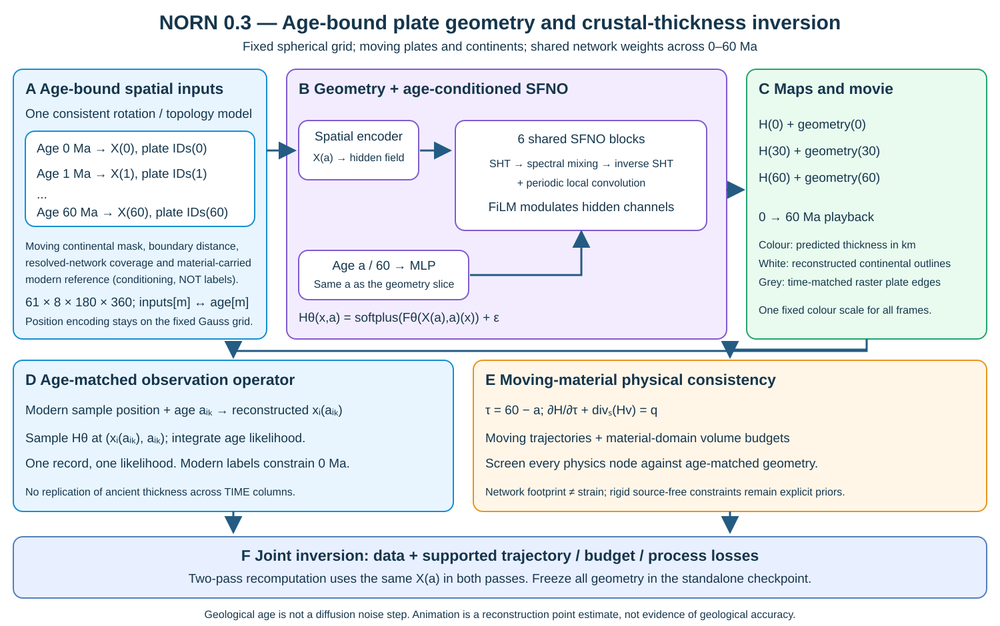
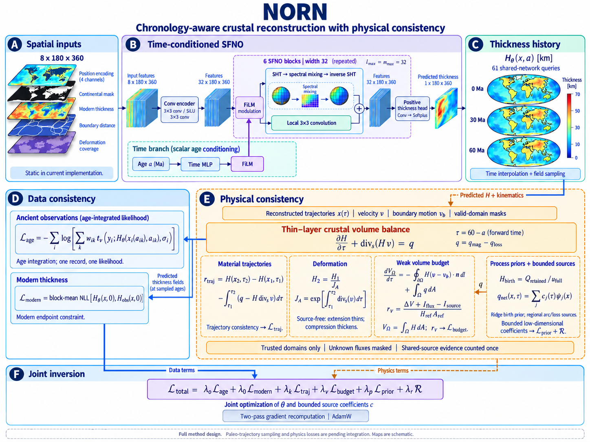

# NORN 框架图与方法学

0.5 当前主图以 **no_physics baseline** 为主：双 GMT 同龄输入、选定 SFNO、数据 loss 和验证 MAE 选模；可选 `physics` 标签共享全部条件，只增加显式先验。gated package 保留为候选，不冒充默认改进：

当前两标签及参考框架核验见 [GMT 文档](../gmt_tags.md)，数据目标和历史消融见[纯 ML 文档](../ml_baseline.md)。以下 0.3 图保留为动态几何与历史物理扩展说明：`X(a)` 与年龄条件配对，冻结同龄大陆／板界／网络图层，视频展示移动大陆及预测厚度颜色。

原项目 `fig` 和 `methods` 文件保留作为历史设计资料；下面的副本与原文件逐字节一致，不代表当前动态输入接口：

- [中文 Methods PDF](NORN_Methods_CN.pdf)
- [LaTeX 源文件](NORN_Methods_CN.tex)
- [框架图](figures/norn_framework.png)

Methods 正文涵盖厚度场表示、年代边缘似然、现代端点、材料轨迹、面积变形、弱形式体积预算、过程先验与受限源项，以及联合反演和两遍梯度重计算。

原文中的“待接入”记录文档编写时的实现状态，原文件保持不变。0.3 引入、0.5 接入双 GMT 的动态输入和视频见 [动态重建](../dynamic.md)；具体计算、资料适用范围和测试证据见 [方法实现说明](../method.md)、[物理约束接口](../physics.md) 和 [运行验证](../validation.md)。图中地图为示意。
